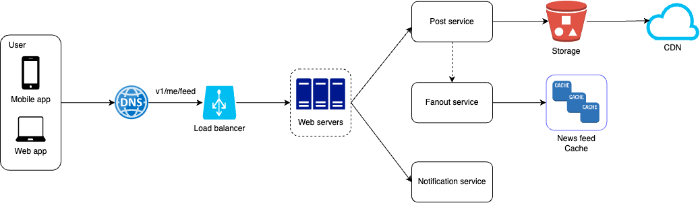
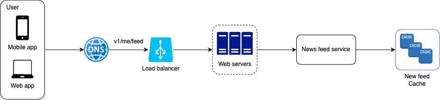

# A News feed System

The News Feed is a continuously updating stream of stories located at the center of your home page. It features status updates, photos, videos, links, app activity, and likes from the people, pages, and groups you follow.

# Requirement

- Both mobile app and web app.
- A user can publish a post and see their friends’ posts on the news feed page.
- The feed is sorted by reverse chronological order.
- A user can have 5000 friends.
- The feed can contain the media such as image, video or just text.

# Propose high-level design

The design is separated into two flows:
- Feed publishing: when a user publishes a post, the relevant data is stored in both the cache and the database. The post is then shared to their friends' News Feeds.
- News feed fetching: the news feed is generated by collecting friends' posts and displaying them in reverse chronological order.

## Feed publishing

*POST /v1/me/feed*
Body:
    - content: text of the post.
    - files: media files for the post such as image and video.
Headers:
    - authorization: it is token used to authenticate API requests.

## News feed fetching

*GET /v1/me/feed*
Headers:
    - authorization: it is token used to authenticate API requests.

## High-level design of feed publishing flow



- User: A user can view News Feeds through a browser or mobile app. When making a post with the content "Hello World" the user sends a request to the API:
```/v1/me/feed```

- Load Balancer: Distributes incoming traffic to web servers.

- Web Servers: Forward the traffic to the appropriate internal services.

- Post Service: Saves the post in both the database and cache and upload the media files to the storage such as AWS S3 and cache file on CDN such as AWS CloudFront.

- Fanout Service: Distributes the new post to the News Feeds of the user's friends. The News Feed data is stored in cache for quick access.

- Notification Service: Notifies friends that new content is available by sending push notifications.


## High-level design of news feed fetching flow



- User: The user sends a request to retrieve their News Feed using the endpoint:
```/v1/me/feed```

- Load Balancer: Directs incoming traffic to the web servers.

- Web Servers: Route the request to the News Feed service.

- News Feed Service: Retrieves the News Feed data from the cache.

- News Feed Cache: Stores the necessary News Feed IDs to display the feed.

## Feed publishing deep dive

