# A Notification System

A notification keeps users informed with crucial updates such as breaking news, product announcements, events, and promotions. It has become an essential part of our daily lives.


# Requirements

- Push notifications, SMS messages, and email
- Soft real-time system
- Support device: iOS, android, pc
- User is able to reject notification
- 10 million mobile push notifications, 1 million SMS messages, and 5 million emails

## High level design

Let's begin by examining how each type of notification functions at a high level.

### iOS push notification

- Provider: A provider builds and sends notification requests to Apple Push Notification Service (APNS)
- APNS: This is a remote service provided by Apple to propagate push notifications to iOS
devices.
- iOS Device: It is the end client, which receives push notifications.

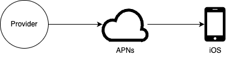

### Android push notification

- Firebase Cloud Messaging (FCM) is commonly used to send push notifications to Android devices.

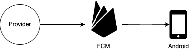

### SMS message

- Third-party SMS services like Twilio can send the sms to user.

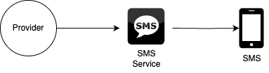

### Email 
- Third-party email services like Mailjet can send the email to users.

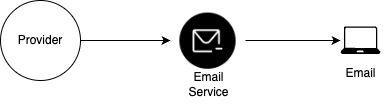

### Shows the design after including all the third-party services

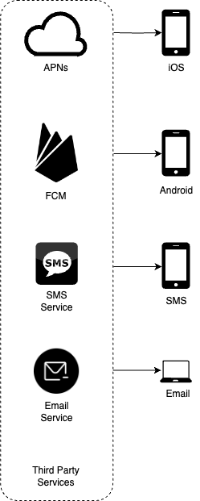

## Contact info gathering flow

In order to send notifications, we must collect mobile device tokens, phone numbers, or email addresses. When a user installs our app or registers for the first time, the API servers gather the user's contact information and store it in the database.

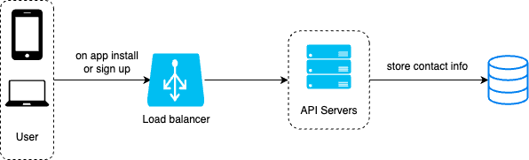

The database has simplified tables for storing contact information. Email addresses and phone numbers are kept in the user table, while device tokens are stored in the device table. Since a user can have multiple devices, push notifications can be sent to all of them.

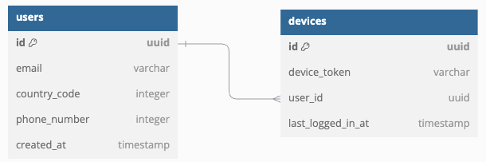

## High-level design

The details of each system component are outlined below.

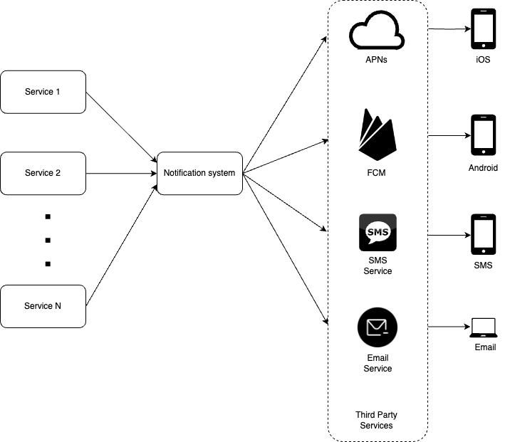

**Service 1 to N**: A service can take the form of a microservice, a scheduled cron job, or a distributed system that initiates notification-sending events. For example, a billing service sends emails to remind customers about their upcoming subscription payments or a shopping service sends notifications to inform them that their package is on the way.

**Notification system**: The notification system is the core component for sending notifications. Initially, a single notification server is utilized, offering APIs for services 1 through N and generating notification payloads for third-party services.

**Third party services**: Third-party services handle the delivery of notifications to users. When integrating with these services, it's essential to prioritize extensibility. A well-designed extensible system allows for easy addition or removal of third-party services. Another key consideration is the potential unavailability of certain third-party services in new markets or in the future. For example, FCM is unavailable in China, so alternative services like JPush, PushY, and others are used in such regions.

**iOS, Android, SMS, Email**: Users receive notifications on their devices.

**Disadvantages**:
- Single point of failure (SPOF): A single notification server means SPOF.
- Hard to scale: The notification system manages all aspects of push notifications within a single server. This setup makes it difficult to scale databases, caches, and various notification processing components independently.
- Performace bottleneck: Processing and sending notifications can be resource-intensive. Actions like sending emails using HTML templates and waiting for responses from third-party services may take time. Handling all these tasks within a single system may cause overload, especially during peak periods.

## High-level design (improved)

After identifying the challenges in the initial design, we have made the following improvements.
- Separate the database and cache out of notification server.
- Add more notification servers and setup auotmatic horizontal scaling.
- Implement the message queue to decouple the third party service.

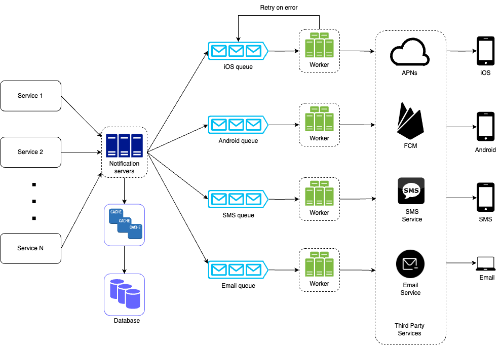

The ideal way to examine the diagram is starting on the left and moving to the right

**Service 1 to N**: They represent various services that send notifications through APIs provided by the notification servers.

**Notification Servers**: They offer the following functionalities:

- Provide APIs for services to send notifications, with access restricted to internal or verified clients to prevent spam.
- Perform basic validations, such as verifying emails, phone numbers, and other required data.
- Query databases or caches to retrieve the information necessary for rendering notifications. 
- Enqueue notification data into message queues for parallel processing.

**Cache**: User info, device info, notification templates are cached.

**Database**: It stores data about user information, notification, settings, etc.

**Message queue**: They eliminate dependencies between components. Message queues act as buffers when handling large volumes of notifications. Each notification type is assigned its own message queue, ensuring that an outage in one third-party service does not impact other notification types.

**Worker**: Workers are a group of servers that retrieve notification events from message queues and forward them to the appropriate third-party services. If an error occurs, the worker will reinsert the payload into the message queue for reprocessing from the start.

**Third-party services**: Already explained in the initial design.

**iOS, Android, SMS, Email**: Already explained in the initial design.

**Flow**: Let's now look at how all the components work together to send a notification:
- A service calls the APIs provided by the notification servers to trigger a notification.
- The notification servers retrieve metadata, such as user information, device tokens, and notification settings, from the cache or database.
- A notification event is placed in the appropriate queue for processing. For example, an iOS push notification event is sent to the iOS queue.
- Workers pull notification events from the message queues.
- Workers then send the notifications to third-party services.
- The third-party services deliver the notifications to the user devices.

## Design deep dive
In the high-level design, we covered various notification types, the process of gathering contact information, and the flow of sending and receiving notifications. In the deep dive, we will explore the following:
- Reliability.
- Additional components and considerations, such as notification templates, notification settings, rate limiting, retry mechanisms, security in push notifications, monitoring queued notifications, and event tracking.
- Updated design.

### Reliability
When designing a notification system for distributed environments, we need to consider several critical reliability factors

**How to prevent data loss?**
One of the key requirements of a notification system is that it must not lose data. While notifications can typically be delayed or sent out of order, they must never be lost. To meet this requirement, the system stores notification data in a database and incorporates a retry mechanism. A notification log database is used to ensure data persistence.

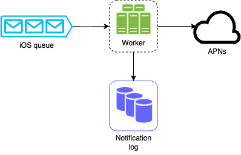

**Will recipients receive a notification exactly once?**

The short answer is no. While notifications are usually delivered exactly once, the distributed nature of the system can sometimes lead to duplicates. To minimize duplication, we implement a deduplication mechanism and carefully address each failure scenario. A basic deduplication logic works as follows: when a notification event arrives, we check if the event ID has been encountered before. If it has, the event is discarded; otherwise, the notification is sent. For those interested in why exactly-once delivery isn't guaranteed, please refer to the [link](https://bravenewgeek.com/you-cannot-have-exactly-once-delivery/). 

### Additional Components and Considerations
While we've covered how to collect user contact information and send and receive notifications, a complete notification system involves much more. In this section, we’ll explore additional components such as template reuse, notification settings, event tracking, system monitoring, rate limiting, and more.

**Notification template**
A large notification system can dispatch millions of notifications daily, many of which share a similar format. To streamline this process, notification templates are introduced to prevent the need for creating each notification from scratch. A notification template is a preformatted structure that allows you to generate unique notifications by customizing parameters, styling, tracking links, and more. Below is an example template for push notifications.

Notification Title:
Your order has been shipped!

Notification Body:
Hi {{userName}}, your order #{{orderNumber}} is on its way! You can track your shipment using the link below.

The advantages of using notification templates include ensuring a consistent format, minimizing errors, and saving time.

**Notification settings**
Users typically receive an excessive number of notifications each day, which can lead to feelings of overwhelm. To address this, many websites and apps provide users with detailed control over their notification settings. This information is stored in the notification settings table, which includes the following fields:

```
user_id uuid
channel varchar # push notification, email or SMS
opt_in boolean # opt-in to receive notification
```

Before sending any notification to a user, we first verify whether they have opted in to receive that type of notification.

**Rate Limiting**
To prevent overwhelming users with excessive notifications, we can impose limits on the number of notifications a user can receive. This is crucial, as frequent notifications may lead users to disable them entirely.

**Retry Mechanism**
If a third-party service fails to deliver a notification, the notification will be added to the message queue for a retry. If the issue continues, an alert will be sent to the developers.

**Security in Push Notifications**
For iOS or Android applications, an appKey and appSecret are used to secure push notification APIs. Only authenticated or verified clients are permitted to send push notifications through our APIs. Interested users can refer to the reference material for more information.

**Monitoring Queued Notifications**
A key metric to track is the total number of queued notifications. A high number indicates that notification events are not being processed quickly enough by workers. To prevent delays in notification delivery, additional workers may be required.

**Event tracking**
Notification metrics, such as open rate, click rate, and engagement, are crucial for understanding customer behavior. The analytics service implements event tracking, which typically requires integration between the notification system and the analytics service. The below diagram illustrates examples of events that may be tracked for analytics purposes.

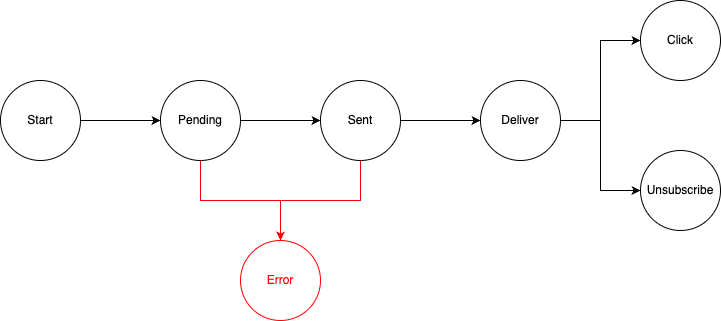

**Update design**

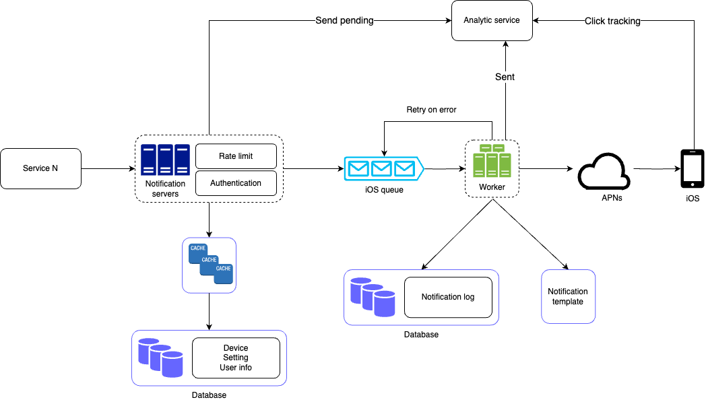

Bringing everything together, this design incorporates several key improvements and features:

- Notification servers now include authentication and rate-limiting to control access and prevent overloading users with notifications.
- A retry mechanism ensures that failed notifications are re-queued and retried by workers a set number of times.
- Notification templates streamline the creation process by offering a consistent and efficient method for building notifications.
- Monitoring and tracking systems have been added to monitor system health and track key metrics, enabling future optimizations and improvements.
These enhancements provide a more robust, scalable, and user-friendly notification system.

## Conclusion

Notifications are essential for keeping us updated with important information, whether it's a push notification about your favorite Netflix movie, an email with product discounts, or a message confirming an online shopping payment.

We outlined the design of a scalable notification system that supports various formats, including push notifications, SMS messages, and emails. To decouple system components, we employed message queues.

Beyond the high-level design, we explored additional components and optimizations:

- Reliability: A robust retry mechanism was introduced to minimize the failure rate.
- Security: An appKey/appSecret pair is used to ensure that only verified clients can send notifications.
- Tracking and Monitoring: These features are integrated throughout the notification flow to capture key metrics.
- User Settings: The system respects user preferences by checking their opt-in status before sending notifications.
- Rate Limiting: Users will appreciate having a cap on the frequency of notifications they receive, preventing notification overload.